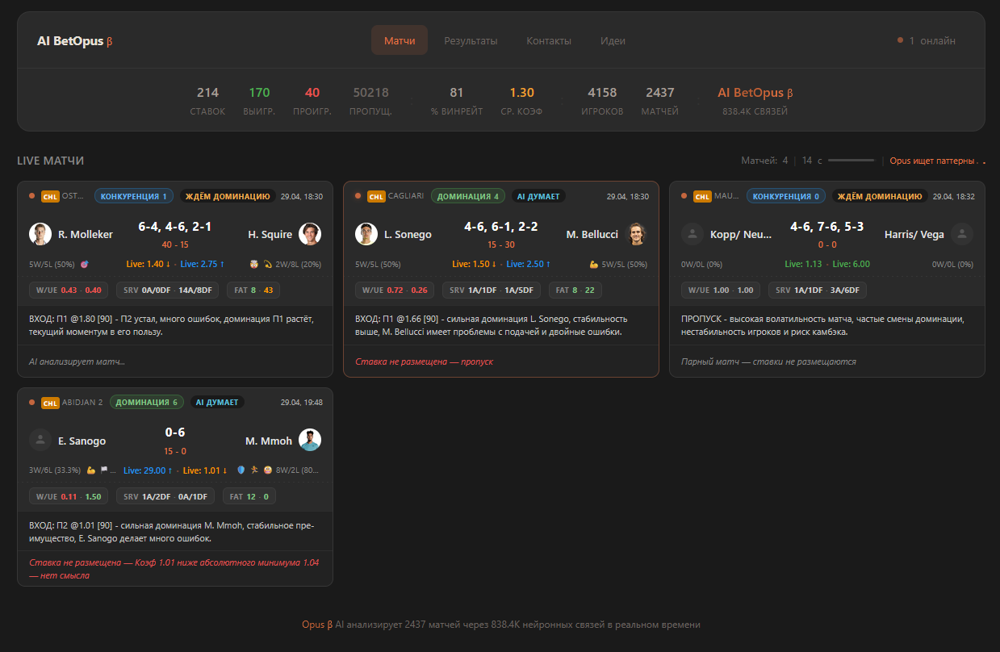

# Betopus — архитектура и движок принятия решений

<p align="center">
  
</p>

> AI-платформа для live-ставок на теннис: сканирование в реальном времени, эзотерическая математика, многослойная валидация сигналов, полный аудит каждого решения.

<p>
  
  
  
  
  
</p>

<p>
  
  
  
  
</p>

<p>
  
  
  
  
  
  
</p>

---

## Содержание

1. [Что это](#что-это)
2. [Сквозной конвейер](#сквозной-конвейер)
3. [Что собираем с каждого скана](#что-собираем-с-каждого-скана)
4. [Сигналы, которые видит AI](#сигналы-которые-видит-ai)
5. [Фазы матча](#фазы-матча)
6. [Слой эзотерической математики](#слой-эзотерической-математики)
7. [Аналитические модули](#аналитические-модули)
8. [Как принимается решение](#как-принимается-решение)
9. [Валидация: 38 фильтров](#валидация-38-фильтров)
10. [Multi-signal confirmation](#multi-signal-confirmation)
11. [Память и состояние](#память-и-состояние)
12. [Обратная связь для AI](#обратная-связь-для-ai)
13. [Стек технологий](#стек-технологий)

---

## Что это

Betopus отслеживает все live-матчи в теннисе по всему миру с частотой 12–30 секунд. Каждый скан запускает детерминированный конвейер:

```text
1. Запрос состояния матча у поставщика live-данных
2. Расчёт статистических, математических и контекстных индикаторов
3. Передача структурированного промпта из 26 секций в LLM (Gemini или GPT-4o)
4. Прогон рекомендации модели через 38 жёстких фильтров
5. Ставка размещается → Telegram → snapshot из 51 поля
```

Система держится на одном правиле: **ни один сигнал в одиночку не размещает ставку**. LLM — это один голос среди многих. Право вето есть у математики, рынка, истории и риск-фильтров.

---

## Сквозной конвейер

Логика конвейера построена линейно. Сканер забирает данные у API раз в 12 секунд и сохраняет их в контекст матча (Redis для горячего кэша, PostgreSQL для долгого хранения). Дальше блок индикаторов считает OPX (балл доминации 0–10), прогоняет данные через 7 эзотерических алгоритмов, 8 аналитических модулей, классификатор трейтов игроков и калькулятор усталости. Полученный контекст собирается в промпт из 26 секций и уходит в Gemini или GPT-4o.

LLM возвращает ответ строго в одном формате: `ВХОД: П1 @1.35 [92] - причина` или `ПРОПУСК`. Этот ответ проходит через цепочку из 38 фильтров с правилами обхода (bypass-режимами). Если все фильтры пройдены — ставка размещается, уходит уведомление в Telegram, фиксируется snapshot из 51 поля. Если не пройден хотя бы один — решение всё равно записывается, но с кодом причины отказа.

Всё логируется. У каждого отказа стабильный код. У каждой принятой ставки — snapshot из 51 поля, привязанный к породившему её скану. По любому решению можно через год восстановить полный контекст и понять, почему было сделано именно так.

---

## Что собираем с каждого скана

Для каждого игрока на каждом скане фиксируется 15 ключевых показателей: процент и абсолютное число выигранных очков, общее число разыгранных очков, процент выигранных на своей подаче, процент выигранных на приёме, процент и абсолютное число реализованных брейк-пойнтов, общее число брейк-пойнтов, процент удержанных подач, процент выигранных приёмных геймов, общий процент выигранных геймов, виннеры, невынужденные ошибки, эйсы и двойные ошибки.

Из второго источника данных (WebSocket) подтягиваются: процент первой подачи, очки на первой подаче, очки на второй подаче, спасённые брейк-пойнты, результаты последних 10 розыгрышей.

Контекст скана дополнительно включает: счёт по геймам в текущем сете, счёт внутри текущего гейма, кто подаёт, наличие брейк-пойнта прямо сейчас, номер сета, разбивку по сетам, последние выигранные геймы, текущий моментум.

Из всего этого вычисляются: OPX (Opportunity Index, балл доминации 0–10), W/UE ratio (виннеры на ошибку — качество игры), Quality Score (виннеры минус невынужденные ошибки).

В типичном матче набирается 200–300 сканов, каждый сохраняется как строка в `match_scans` с JSONB-полем для гибкости.

---

## Сигналы, которые видит AI

Перед каждым решением модель получает агрегированный контекст. Это не «текущий счёт + коэффициент» — это многоуровневый снимок матча из десятков измерений. Ниже — полная карта сигналов, без раскрытия конкретных порогов и весов.

### 1. Метрики доминации и качества игры

```text
OPX (Opportunity Index)        интегральный балл доминации 0–10
W/UE Ratio                     виннеры на ошибку — качество игры
Quality Score                  чистое качество (winners − unforced errors)
Service Hold %                 удержание подачи
Return Win %                   эффективность приёма
Break Points Conversion %      конвертация брейк-пойнтов
Break Points Saved %           процент спасённых BP под давлением
Service Games / Return Games   динамика по типам геймов
```

### 2. Эзотерическая математика (3 активных алгоритма)

```text
Shannon Entropy                энтропия по очкам, геймам и подаче
  ├── Match Entropy            общий хаос матча
  ├── Point Entropy            хаос на уровне очков
  ├── Game Entropy             хаос на уровне геймов
  └── Service Entropy          хаос подачной серии

Hurst Exponent                 экспонента тренда per-player
  ├── H1 / H2                  отдельно для каждого игрока
  ├── Match Hurst              интегральный по матчу
  ├── Hurst Divergence         |H1 − H2| — направленный сигнал
  └── Hurst Classification     trending / random / reverting

Z-Score Anomalies              детектор статистических аномалий
  ├── Anomaly Count            число сканов с отклонением > 2σ
  ├── Anomaly Severity         насколько сильное отклонение
  └── Anomaly Pattern          тип аномалии (serve / errors / BP)

Esoteric Confluence            агрегатор: bullish / bearish / neutral / red flag
```

### 3. Динамические индикаторы (8 аналитических модулей)

```text
Error Trend                    динамика W/UE — improving / stable / deteriorating / collapsing
Error Surge Detector           резкий выброс ошибок за окно сканов
Clutch Factor                  поведение под давлением — choker / shaky / solid / ice-cold
Serve Dynamics                 регрессия наклона качества подачи
  ├── Serve Slope              скорость деградации/улучшения
  ├── Serve Catastrophe Flag   аварийный коллапс подачи
  └── Double Fault Spike       выброс двойных ошибок
Value Bet Engine               edge модели против рынка
  ├── Model Probability        собственный расчёт вероятности
  ├── Implied Probability      из коэффициента букмекера
  ├── Edge                     разница (positive/negative value)
  └── Golden Bet Flag          максимальное выравнивание сигналов
Surface Context                покрытие × стиль игрока
  ├── Surface Type             hard / clay / grass
  ├── Player Style             big_server / baseliner / allcourt
  └── Surface Fit Score        соответствие стиля покрытию
Depletion Effect               предсказание провала после затяжных геймов
Court Side Asymmetry           разница производительности по сторонам
Post-Break Collapse Pattern    «героические сейвы → брейк-бэк → коллапс»
Signal Confirmation Meta       агрегатор всех модулей + детектор fake leader
```

### 4. Усталость (Fatigue Score 0–100)

```text
Recovery Component             дни отдыха перед матчем
  ├── Days Since Last Match    
  └── Last Match Duration Bonus  если предыдущий матч был длинным
Workload Component             накопленная нагрузка
  ├── Matches Last 7 Days
  └── Matches Last 3 Days      детектор перегруза
Performance Decline Component  падение показателей по сетам
  ├── Serve Decline Per Set
  ├── BP Conversion Decline
  └── Sets Won Trend
Esoteric Fatigue Component     отражение усталости в математике
  ├── Entropy Drift            рост хаоса как признак усталости
  ├── Hurst Decay              потеря тренда
  └── Anomaly Acceleration

Fatigue Differential           разница между игроками: MUCH_FRESHER / FRESHER / NEUTRAL
Fatigue Risk Level             FRESH / MILD / MODERATE / HIGH / CRITICAL
```

### 5. Профиль игрока (исторический отпечаток)

```text
Comeback Rate                  как часто отыгрывается с проигранного сета
Anti-Comeback Rate             как часто удерживает преимущество
Break Point Mastery            конвертация BP за всю историю
Domination Average             средний OPX в выигранных матчах
Reliability Score              интегральный скор надёжности игрока
AI Prediction Accuracy         как часто предсказания на этого игрока сбывались

Esoteric Fingerprint
  ├── Avg Entropy              типичный уровень хаоса игрока
  ├── Avg Hurst                склонность к трендам или развалам
  ├── Avg OPX                  усреднённая доминация
  └── Style Pattern            устойчивый паттерн поведения
```

### 6. Трейты — характер и состояние

```text
CHARACTER (постоянные, из истории)
  Камбэкер           высокий комбэк-рейт
  Антикамбэк         удерживает преимущество
  Брейк-мастер       стабильно конвертирует BP
  Доминатор          играет «по нотам»
  Снайпер            высокая надёжность
  Трендовик          устойчивый Hurst
  Хаотик             высокая средняя энтропия

STATE (живые, из текущего матча)
  Крепость           удержание подачи на пике
  Агрессор           высокий темп виннеров
  Тильт              серия двойных ошибок
  Марафонец          затяжной матч
  Валидольный        много переломов
  Спад 2-го сета     падение показателей по сетам
```

Ценность системы трейтов в их пересечении: «камбэкер сейчас в тильте» — это противоречие, на которое AI обращает внимание. Так же как «антикамбэк в состоянии крепости» — это сигнал максимальной устойчивости.

### 7. Контекст матча и фазы

```text
Match Phase                    OBSERVATION / PREDICTION / TRACKING
Phase Timeline                 длительности фаз доминации/конкуренции
Reversal History               моменты смены лидера (с номером скана и счётом)
Reversal Count                 общее число переломов
Stability Classification       стабильный / умеренный / волатильный
Volatility Score               количественная мера волатильности
Domination Trend               направление текущего тренда
Garbage Time Score             0–100, признак «матч де-факто решён»
```

### 8. Рынок коэффициентов

```text
Open Odds                      открывающие коэффициенты
Current Odds                   текущие live-коэффициенты
Odds Direction                 ↑ / ↓ для каждой стороны
Favorite Switch                сменился ли фаворит
Steam Move Detector            подозрительные резкие движения
Implied Probability            вероятность из текущего коэф.
Closing Line Drift             насколько рынок ушёл от открытия
Synthetic Odds                 fallback-расчёт если букмекер не даёт линию
```

### 9. Турнир и контекст

```text
Tournament Level               ATP / WTA / ITF / Challenger / Exhibition
Tournament Rank                числовой ранг важности (1–8)
Tournament Round               круг турнира (Q / R32 / R16 / QF / SF / F)
Surface                        hard / clay / grass / carpet
Indoor / Outdoor               флаг закрытого корта
Prize Money Tier               уровень призового фонда
Best Of                        3 / 5 сетов
```

### 10. История и H2H

```text
H2H Record                     статистика личных встреч
H2H By Surface                 H2H именно на текущем покрытии
Recent Form                    результаты последних 5–10 матчей
Tournament Form                выступления на этом турнире в прошлом
Surface Coverage               как часто игрок выступает на этом покрытии
Player News                    свежие новости (травмы, форма, личное)
```

### 11. Камбэк-детектор

```text
Comeback Score                 0–100, вероятность отыгрыша
Comeback Risk Reasons          конкретные причины: тренд / Hurst / BP / serve
Anti-Comeback Confidence       насколько крепко лидер держит преимущество
Lead Stability                 устойчивость текущего отрыва
```

### 12. Обратная связь по работе AI

```text
Current Win Rate %             точность по последним ставкам
Current ROI %                  доходность модели
Last 5 Predictions             предсказания с маркерами ✓ / ✗
Top Mistake Categories         три главных типа ошибок за 7 дней
Confidence Calibration         когда AI говорит [92], как часто прав?
Silent OBSERVATION Forecasts   что предсказывал в фазе наблюдения
```

### Итог по объёму контекста

```text
~30   статистических метрик матча
 7    эзотерических индикаторов (3 активных + конфлуенс + классификации)
 8    аналитических модулей с собственным выходом
 4    компонента усталости + дифференциал + риск-уровень
14    трейтов (7 характер + 7 состояния)
 7    параметров профиля игрока
 8    индикаторов рынка
 7    параметров турнирного контекста
 6    параметров истории и H2H
 4    выхода камбэк-детектора
 6    каналов обратной связи AI
─────────────────────────────────────
~100  независимых сигналов на одно решение
```

Ни один человек-аналитик не способен удерживать столько измерений одновременно в реальном времени. Именно объём и согласованность контекста — то, что превращает LLM из «модного чат-бота» в работающий инструмент анализа.

---

## Фазы матча

Система намеренно замедляет принятие решений в первом сете.

```text
OBSERVATION  (сет 1)       AI молча копит данные, ставки заблокированы
PREDICTION   (конец сета)  Один взвешенный прогноз по всем молчаливым наблюдениям
TRACKING     (сет 2+)      Ставки разрешены, конвейер работает в полную силу
```

`OBSERVATION` нужен потому, что в раннем матче слишком много шума, и LLM склонна реагировать на ложные сигналы. `PREDICTION` собирает все молчаливые прогнозы за сет в одно решение. `TRACKING` — основная рабочая фаза.

Исключение: при OPX ≥ 8 со счётом 5-0 или 6-0 матч сразу переходит в `TRACKING` — экстремальная доминация сама по себе является достаточным сигналом, ждать конца сета бессмысленно.

Идея фаз: заставить модель сначала посмотреть весь первый сет, а потом сделать одно осмысленное предсказание со всем накопленным контекстом. Это резко снижает количество ложных входов на ранней стадии матча.

---

## Слой эзотерической математики

Идея заимствована из обработки сигналов и финансового анализа: применить алгоритмы из других областей к потокам теннисных данных по очкам и геймам. В продакшене работают три алгоритма; ещё четыре реализованы, но отключены из-за слабого сигнала на этой задаче.

**Энтропия Шеннона** — мера хаоса. Считается отдельно для очковой, геймовой и подачной энтропии. Применение: высокая энтропия плюс ITF-турнир блокирует TOTAL_OVER.

```text
H = −Σ(p · log₂ p)

H < 0.85       предсказуемый матч
0.85 ≤ H ≤ 0.97  средний
H > 0.97       хаотичный
```

**Экспонента Хёрста** (R/S-анализ) — отличает устойчивый тренд от возврата к среднему. Считается отдельно для каждого игрока. Минимум 5 сканов.

```text
H > 0.65   сильный тренд (доминация будет усиливаться)
H ≈ 0.5    случайное блуждание
H < 0.35   возврат к среднему (вероятен камбэк)

|H1 − H2| > 0.25   сильный направленный сигнал (дивергенция)
```

**Z-Score детектор аномалий** — находит сканы, где показатели отклоняются больше чем на 2σ от среднего по матчу. Три и более аномалии означают, что ситуация нестабильна. Минимум 3 скана.

Отключённые: Фибоначчи, фрактальная размерность, циклический анализ, закон Бенфорда.

**Правило confluence (слияние сигналов).** Каждый индикатор классифицируется как `bullish` / `bearish` / `neutral` / `red flag`. AI видит итог:

```text
4+ bullish     идеальный вход
3+ bearish     предупреждение о камбэке
1+ red flag    блокировка
```

Один индикатор — это мнение. Три совпадающих — сигнал. Пять — заявка.

---

## Аналитические модули

Восемь специализированных модулей плюс мета-агрегатор. Каждый возвращает оценку уверенности и кормит систему мульти-сигнального скоринга.

**Error Trend** — самый сильный одиночный индикатор. Отслеживает динамику отношения виннеры / невынужденные ошибки. Падение с 1.8 до 1.3 означает, что игрок разваливается. Отдельно фиксируется error surge — резкий рост ошибок на 30%+ за 3 скана. Классификация: improving / stable / deteriorating / collapsing.

**Clutch Factor** — поведение под давлением через тренд конвертации брейк-пойнтов. Choker — подача выше 65%, но конвертация BP ниже 30% (проваливается в важных моментах). Ice-cold — конвертация BP 55%+ при подаче 60%+ (хладнокровен). Shaky и Solid — промежуточные состояния.

**Serve Dynamics** — линейная регрессия наклона качества подачи по сканам. Catastrophe — slope ниже −3 и падение более 15% от пика. Collapse — slope ниже −2 и падение более 10%. DF spike — две и более двойных ошибок за 3 скана.

**Value Bet** — сравнение модельной вероятности с подразумеваемой по коэффициенту букмекера.

```text
modelProb = 0.5 + (points% × 0.30) + (OPX/7 × 0.30) + (Hurst × 0.20) + (Entropy × 0.20)
edge      = modelProb − impliedProb

edge > 10% + 3 bullish + дрейф коэф. вверх   golden bet
edge > 15%                                    ошибка рынка
AI ≥ 90% но коэф. растёт                      odds refutation → SKIP
```

**Surface Context** — связка покрытия (hard / clay / grass) и стиля игрока (big_server / baseliner / allcourt). Big-server на траве смещает в OVER (быстрые геймы, мало брейков). Baseliner на грунте — в UNDER. Кэшируется на матч.

**Depletion Effect** — затяжные геймы на три и более скана предсказывают провал в следующем гейме. Цель — определить, кто истощится сильнее.

**Court Side** — асимметрия по сторонам корта (forehand vs backhand) после смены сторон. Минимум 8 сканов.

**Post-Break Collapse** — паттерн «героические сейвы → брейк-бэк → 80% вероятность коллапса в следующем гейме». Эмоциональное истощение после борьбы.

**Signal Confirmation** (мета-модуль) — агрегирует все сигналы. Распознаёт три ключевых паттерна: odds refutation (рынок против AI), golden bet (всё выровнено и рынок расходится), fake leader (лидер по счёту, но индикаторы против).

Все модули работают с graceful degradation: каждый объявляет минимум данных и возвращает `null`, пока этот минимум не накоплен.

---

## Как принимается решение

LLM получает структурированный промпт из 26 секций. Перечислю их по содержанию.

Заголовок матча с движением live-коэффициентов. Маркер парных матчей (если doubles — отключаются профильные блоки). Обратная связь по статистике ставок: WR%, ROI, недавние ошибки. Сравнение предматчевого прогноза с текущей live-картиной. Молчаливые предсказания фазы OBSERVATION. Якорь финального предсказания за первый сет. Расширенные профили игроков (камбэк-рейт, конвертация BP, эзотерический профиль). Базовые профили (рейтинг, покрытия). История игроков и последние матчи. Личные встречи. Информация о турнире. Движение коэффициентов от открытия до текущего момента. Новости игроков (травмы, форма). Таймлайн фаз матча. История переломов. Текущая live-статистика. Последние 5 AI-предсказаний с маркерами результатов. Анализ паттернов (волатильность, классификация стабильности). Секция камбэка (скоринг 0–100, причины риска). Блок эзотерической математики. Трейты игроков (характер плюс состояние). Усталость по каждому игроку с жёсткими блокировками при HIGH+. Продвинутая аналитика (9 подмодулей). Причина вызова AI (доминация / конкуренция / камбэк / retry). Запрос рекомендации с шкалой уверенности и форматом ответа. Режим решения (обязательный ВХОД или ПРОПУСК, запрет ЖДАТЬ в фазе PREDICTION).

Оптимизация токенов: профили игроков дедуплицируются, в промпт попадает только один источник из трёх (расширенный → базовый → исторический), что экономит 30–40% токенов.

Формат ответа жёсткий — любой другой считается ошибкой парсинга и эквивалентен пропуску:

```text
ВХОД: П1 @1.35 [92] - причина
ВХОД: ТБ 21.5 @1.85 [88] - причина
ВХОД: Ф1 -3.5 @1.75 [90] - причина
ПРОПУСК
```

---

## Валидация: 38 фильтров

Каждая рекомендация AI проходит цепочку фильтров в [src/core/betting-bot.js](src/core/betting-bot.js). У каждого фильтра стабильный код причины отказа; отклонённое решение всё равно сохраняется в snapshot вместе с этим кодом — это даёт возможность тюнить цепочку по историческим данным.

Базовые проверки: включены ли авто-ставки, есть ли дубликат за последние 5 минут, сыграно ли минимум геймов (6 для WIN/HC, 4 для TOTAL), нет ли проблемы позднего входа (меньше 15 сканов при больше 3 геймов на скан), нет ли уже размещённой ставки на этот матч, рекомендует ли AI именно ВХОД, распознан ли тип ставки, разрешён ли он в настройках, определён ли конкретный игрок для WIN/HC, не проигрывает ли он по сетам.

Проверки коэффициентов: иерархия источников (API live → API closest → synthetic → AI-parsed → fallback 1.00), отказ от TOTAL/HC если коэффициент не от букмекера, абсолютный минимум 1.04 (всё что ниже — матч уже решён), минимум и максимум коэффициента из настроек.

Проверки доминации: достаточность OPX (по умолчанию минимум 4), при OPX 2–3 включается мульти-сигнальное подтверждение, при OPX 0–1 ставка на победу всегда отклоняется. Отдельная осторожность в третьем сете при OPX ниже 8. Garbage time блокирует TOTAL_OVER. Лимит гандикапа на уровне −6.5.

Проверки рейтинга и турнира: рейтинг выше 300 против топ-100 — это underdog trap. Рейтинг выше 200 при коэффициенте выше 1.60 — слишком рискованно. Тоталы по доминации: TOTAL_OVER разрешён только при OPX 2–3 (исторически 81% WR). Капитуляция в ITF (5-0+ / 6-0 / 6-1) блокирует тоталы. ITF и Exhibition с рангом 7–8 заблокированы полностью. Challenger требует либо OPX≥4, либо коэффициента ниже 1.80, либо уверенности от 90%.

Уверенность и контекст: TOTAL требует 80%+ при OPX≥5 и 85%+ при OPX<5. Ранний тотал на меньше чем 8 сыгранных геймов отклоняется. ITF с грязной энтропией и TOTAL_OVER — отказ. Минимум уверенности AI 80%, для ITF — 92%. Усталость 60+ блокирует WIN/HC, но не TOTAL.

Калибровка от 18 февраля 2026: парные матчи полностью заблокированы. Anti-domination guard запрещает ставить против стороны с OPX ≥ 4. TOTAL_UNDER при марже меньше 10 геймов до линии — отказ. Маржа 10–14 требует уверенности от 88%.

Эзотерические проверки: error collapse (W/UE ratio падает) блокирует WIN/HC на этого игрока. Высокая энтропия блокирует TOTAL (но WIN при высокой энтропии исторически даёт 97% WR — bypass). Hurst reverting (H<0.5) для WIN/HC — отказ. Три и более Z-score аномалии — нестабильно. Odds refutation — рынок против ставки. Fake leader — ведёт по счёту, но индикаторы против.

**Режимы обхода (bypass).**

```text
super-domination       OPX ≥ 8 + conf ≥ 90    → обходит min/max коэф., 3-й сет, ITF-блок
itf-bypass             conf ≥ 92 + OPX ≥ 6    → обходит ITF-фильтр
synthetic-fallback     fallback-коэф.          → обходит проверки коэф.
multi-signal           OPX 2–3 + score ≥ 30    → обходит фильтр доминации
```

Bypass — это не обработчики исключений, а явно описанные edge-кейсы с собственным паспортом и историей.

---

## Multi-signal confirmation

Когда OPX равен 2 или 3 (умеренная доминация, недостаточная для прямой ставки), система запускает скоринг по 14 сигналам.

```text
score = (OPX − 2) × 5 + Σ(весов 14 сигналов)

score ≥ 30   WIN одобрен
```

Базовый балл: 0 при OPX=2, 5 при OPX=3. К нему прибавляются взвешенные сигналы.

Разница в рейтинге даёт до +15 при разрыве более 200 позиций и до −10 при обратном раскладе. Live-коэффициент — до +12 при значении 1.20 и ниже. Процент выигранных очков — до +10 при 60%+. Конвертация брейк-пойнтов — до +8 при 60%+. Лидерство по сетам — до +10. Лидерство в текущем сете — до +6 при разрыве 3+ геймов. Эзотерический confluence — до +10 за выровненные энтропию, Хёрста, Z-score и дивергенцию, либо до −7 за противоречия. Дифференциал усталости — до +8 если соперник устал на 30+ единиц больше, либо до −5 если устали мы. Уверенность AI — до +10 при 92%+. Clutch Factor — до +8 за ice-cold или −5 за choker. Serve Dynamics — до +10 за коллапс подачи соперника или −8 за коллапс нашей. Value/Golden Bet — до +12 при edge выше 10% и трёх bullish. Surface fit — до +5 за идеальное соответствие или −3 за плохое. Error Trend — до +10 за коллапс ошибок соперника или −8 за наш собственный.

30 баллов и больше — WIN одобрен. Смысл системы: превратить «LLM так считает» в «LLM так считает И математика согласна И рынок согласен».

---

## Память и состояние

В системе три слоя состояния, каждый со своим временем жизни.

**Краткосрочная память — Redis.**

```text
match_context:{eventKey}   история доминации, переломы, AI-прогнозы, фаза
recent_decisions           5-минутная дедупликация решений
ws_subscriptions           активные WebSocket-подписки
TTL = конец матча + 1 час
```

Если Redis недоступен, система переключается на in-memory `Map` в процессе. Падений из-за потери кэша не бывает — просто деградация до per-process памяти.

**Среднесрочная память — PostgreSQL.**

```text
match_scans          200–300 строк/матч, полная статистика + JSONB
decision_snapshots   51 поле на каждое решение (принятое или отклонённое)
bets                 размещённые ставки: результат, источник коэф., manual flag
archived_matches     финальные счёта завершённых матчей
```

`decision_snapshots` — сердце аудита: каждое входное значение, каждый результат фильтра и каждый эзотерический показатель замораживается на момент решения. Время жизни — бессрочное. Это датасет, на котором система учится.

**Долгосрочная память — профили игроков.**

```text
players           1343 игрока, мастер-данные
player_profiles   камбэк-рейт, антикамбэк, конвертация BP,
                  эзотерический отпечаток (avg энтропия / Хёрст / OPX),
                  точность AI-предсказаний, скор надёжности
```

Профили пересчитываются ночью из агрегатов `match_scans`.

Зачем три слоя. Redis отвечает на вопрос «что происходит прямо сейчас» за миллисекунды. PostgreSQL отвечает на вопрос «что мы решили и почему» — навсегда. Профили отвечают на вопрос «как этот конкретный игрок ведёт себя структурно». LLM в своём промпте видит все три слоя. Цепочка валидации читает из всех трёх. Дашборд рендерит все три.

---

## Обратная связь для AI

LLM получает свою собственную статистику в каждом промпте — благодаря этому её тон калибруется под недавние результаты.

В третью секцию промпта попадает текущий Win Rate, текущий ROI, последние 5 предсказаний с маркерами исхода (правильно или нет), три главные категории ошибок за последние 7 дней, калибровка уверенности (когда AI говорил `[92]`, как часто оказывался прав).

Это не fine-tuning — переобучения модели нет. Это чистая контекстная обратная связь. Модель, размещающая ставку N+1, читает результат ставки N в своём же промпте.

В сочетании с датасетом из 51-полевых snapshot'ов это открывает прямой путь к настоящей ML-калибровке: предсказывать «коэффициент прохождения фильтров × историческая WR на конкретной конфигурации» вместо того чтобы доверять заявленной уверенности LLM.

---

## Стек технологий

Среда выполнения — Node.js 18+ на ES-модулях. Веб-фреймворк — Express. AI — OpenAI (GPT-4o или 4o-mini) или Google Gemini, переключение через переменную окружения `AI_PROVIDER`. База данных — PostgreSQL 16 с 29 миграциями. Кэш — Redis 7. Реальное время — WebSocket через библиотеку `ws`. Источник данных — внешний live-провайдер теннисной статистики. Уведомления — Telegram Bot API. Фронтенд — чистый HTML/CSS/JS без фреймворков, Chart.js подгружается лениво с CDN. Авторизация — JWT, только для админки. Менеджер процессов — PM2 с logrotate. Контейнеризация — Docker Compose для PostgreSQL и Redis.

Отказ от фронтенд-фреймворка — осознанное решение: дашборд преимущественно read-only, чувствителен к задержкам и легче эволюционирует на чистом DOM.

---

## Контакты

По всем вопросам — Telegram: [@kitay9](https://t.me/kitay9)

<p>
  <a href="https://t.me/kitay9">
    
  </a>
</p>
